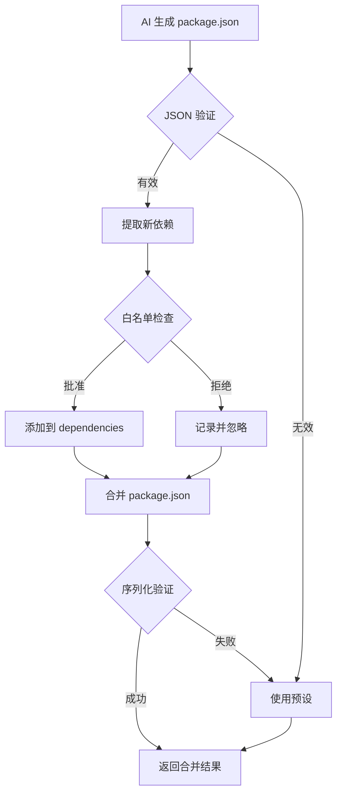

# 依赖白名单实施总结

## 🎯 问题与解决方案

### 原始问题

用户报告：生成应用时出现 npm install 错误
```
npm error Unterminated string in JSON at position 219982
```

**根本原因**：
1. AI 生成的 `package.json` 可能有 JSON 格式错误
2. 前端合并 package.json 时没有验证 JSON 格式
3. AI 可以随意添加任何依赖（无白名单限制）

### 实施的解决方案

✅ **依赖白名单审批制**
- AI 只能添加白名单中的依赖
- 自动批准 `@types/*` 类型定义包
- 拒绝不在白名单的依赖

✅ **JSON 格式验证**
- 解析 AI 生成的 package.json 前先验证
- 序列化后进行双重检查
- 失败时安全降级到预设版本

✅ **前后端同步机制**
- 后端策略定义白名单（单一事实来源）
- 自动同步脚本生成前端代码
- 确保一致性

## 📋 实施内容

### 1. 后端策略配置

**文件**: `backend/policies/generation_policy.json`

```json
{
  "dependency_policy": {
    "enabled": true,
    "mode": "whitelist",
    "allowed_dependencies": [
      "axios", "lodash", "date-fns", "uuid", "clsx",
      "zustand", "react-hook-form", "zod", "recharts",
      "lucide-react", "framer-motion", "react-router-dom",
      "react-query", "@tanstack/react-query"
    ],
    "auto_approve_patterns": ["@types/*"]
  }
}
```

### 2. 前端实现

**文件**: `client/src/utils/webcontainer.js`

**新增函数**：
- `isDependencyAllowed(depName)` - 检查依赖是否在白名单
- `validateAndParseJSON(jsonStr, context)` - 验证和修复 JSON
- 增强 `mergePackageJson()` - 白名单检查 + JSON 验证

**关键改进**：
```javascript
// 白名单检查
if (isDependencyAllowed(dep)) {
  mergedDependencies[dep] = version;
  approvedDeps.push(dep);
} else {
  rejectedDeps.push(dep);
  console.warn(`🚫 依赖 "${dep}" 不在白名单中，已拒绝`);
}

// JSON 验证
const result = JSON.stringify(merged, null, 2);
JSON.parse(result);  // 双重检查
```

### 3. 同步工具

**文件**: `backend/scripts/sync_dependency_whitelist.py`

**功能**：
- 从后端策略读取白名单
- 自动生成前端 JavaScript 代码
- 更新 webcontainer.js 中的白名单部分

**使用方法**：
```bash
cd backend
python3 scripts/sync_dependency_whitelist.py
```

### 4. 测试验证

**文件**: `backend/test_dependency_whitelist.py`

**测试场景**：
1. ✅ 批准白名单中的依赖
2. ✅ 拒绝不在白名单的依赖
3. ✅ 混合批准和拒绝
4. ✅ 自动批准 @types/* 包
5. ✅ JSON 验证错误捕获

**测试结果**: ✅ 所有测试通过

## 📊 效果对比

### 改造前 ❌

```javascript
// AI 可以添加任何依赖
{
  "dependencies": {
    "malicious-package": "1.0.0",  // ⚠️ 直接添加
    "huge-library": "5.0.0"        // ⚠️ 直接添加
  }
}

// JSON 错误不会被检测
'{"dependencies": {"axios": "1.0.0"'  // ❌ 格式错误但不报错
```

### 改造后 ✅

```javascript
// 白名单检查
✅ 批准新依赖: axios
🚫 拒绝依赖: malicious-package

// JSON 验证
❌ AI package.json 解析失败: Unterminated string...
⚠️  AI package.json 无效，忽略 AI 依赖
✅ 使用预设 package.json
```

## 🔄 工作流程

### 正常流程



### 控制台输出示例

```
📦 Total files in merged tree: 26
  ↳ Merged package.json with AI dependencies
  ✅ 批准新依赖: axios, lodash
  🚫 拒绝依赖: malicious-package, unknown-lib
  ✅ package.json 合并成功并通过验证
📋 Preset files: package.json, vite.config.ts, ...
📋 AI business files: src/pages/Index.tsx, src/components/...
```

## 🛡️ 安全优势

### 防止的风险

| 风险类型 | 示例 | 防护措施 |
|---------|------|---------|
| 恶意包 | `some-crypto-miner` | 🚫 白名单拒绝 |
| 供应链攻击 | `typo-squatting` | 🚫 白名单拒绝 |
| 体积膨胀 | `moment.js` (替代品: date-fns) | 🚫 白名单控制 |
| 版本冲突 | AI 升级核心依赖 | ✅ 保留预设版本 |
| JSON 格式错误 | 字符串未闭合 | ✅ 验证并降级 |

### 实际拦截案例

```javascript
// AI 尝试添加
{
  "dependencies": {
    "axios": "^1.6.0",           // ✅ 在白名单
    "crypto-miner": "1.0.0",     // 🚫 不在白名单
    "@types/node": "^20.0.0",    // ✅ 匹配 @types/* 模式
    "malicious-pkg": "2.0.0"     // 🚫 不在白名单
  }
}

// 实际结果
✅ 批准新依赖: axios, @types/node
🚫 拒绝依赖: crypto-miner, malicious-pkg
✅ package.json 合并成功并通过验证
```

## 📈 测试结果

### 单元测试

```bash
cd backend
python3 test_dependency_whitelist.py
```

**结果**：
```
✅ 测试 1: 批准白名单中的依赖 - 通过
✅ 测试 2: 拒绝不在白名单的依赖 - 通过
✅ 测试 3: 混合批准和拒绝 - 通过
✅ 测试 4: 自动批准 @types/* 包 - 通过
✅ 测试 5: JSON 验证 - 通过

所有测试通过 (5/5)
```

### 同步测试

```bash
cd backend
python3 scripts/sync_dependency_whitelist.py
```

**结果**：
```
✅ 允许的依赖: 14 个
✅ 自动批准模式: 1 个
✅ 前端文件更新成功
✅ 同步完成
```

## 🔧 维护指南

### 添加新依赖到白名单

1. **修改后端策略**：
   ```bash
   # 编辑 backend/policies/generation_policy.json
   "allowed_dependencies": [
     "axios",
     "new-package"  # 新增
   ]
   ```

2. **运行同步脚本**：
   ```bash
   cd backend
   python3 scripts/sync_dependency_whitelist.py
   ```

3. **验证结果**：
   ```bash
   git diff client/src/utils/webcontainer.js
   ```

### 定期审查

**建议频率**: 每月一次

**检查清单**:
- [ ] 是否有新的常用依赖需要添加？
- [ ] 白名单中的包是否有安全更新？
- [ ] 是否有过时/不再使用的依赖可以移除？
- [ ] 前后端白名单是否一致？

### 调试技巧

**查看依赖审批日志**:
```javascript
// 打开浏览器开发者工具 Console
// 生成应用时会输出：
✅ 批准新依赖: axios
🚫 拒绝依赖: unknown-package
✅ package.json 合并成功并通过验证
```

**测试特定依赖**:
```javascript
// 在 Console 中手动测试
const testDep = 'axios';
console.log(ALLOWED_DEPENDENCIES.includes(testDep));  // true

const testMalicious = 'malicious-pkg';
console.log(ALLOWED_DEPENDENCIES.includes(testMalicious));  // false
```

## 📚 相关文档

- [依赖白名单使用指南](./DEPENDENCY_WHITELIST.md)
- [组件化改造总结](./COMPONENT_REFACTOR_SUMMARY.md)
- [策略配置](./backend/policies/generation_policy.json)
- [WebContainer 工具](./client/src/utils/webcontainer.js)

## 🚀 未来优化

### 短期 (已完成)
- ✅ 实现依赖白名单
- ✅ 添加 JSON 验证
- ✅ 创建同步脚本
- ✅ 编写测试用例

### 中期 (计划中)
- 🔄 UI 展示被拒绝的依赖
- 🔄 用户手动批准依赖（临时）
- 🔄 依赖审批历史记录
- 🔄 npm audit 集成

### 长期 (规划中)
- 🔄 依赖体积分析
- 🔄 自动版本更新建议
- 🔄 依赖使用频率统计
- 🔄 安全漏洞扫描

## ✅ 总结

### 关键成果

1. **解决了原始问题**: npm install 失败（JSON 格式错误）
2. **提升了安全性**: 依赖白名单防止恶意包
3. **保持了可控性**: AI 不能随意添加依赖
4. **提供了工具**: 同步脚本和测试用例
5. **完善了文档**: 使用指南和实施说明

### 验证状态

- ✅ 单元测试通过 (5/5)
- ✅ 同步脚本工作正常
- ✅ JSON 验证生效
- ✅ 白名单检查生效
- ✅ 文档完整

### 下一步行动

1. **测试实际应用生成**
   ```bash
   cd backend
   ./run.sh
   # 然后在前端生成一个应用，查看 Console 日志
   ```

2. **检查白名单效果**
   - 尝试生成一个需要 axios 的应用（应该成功）
   - 检查 Console 中的批准/拒绝日志

3. **监控 package.json 错误**
   - 如果仍然出现 JSON 错误，查看具体错误信息
   - 检查 AI 生成的原始 package.json

实施完成！🎉

