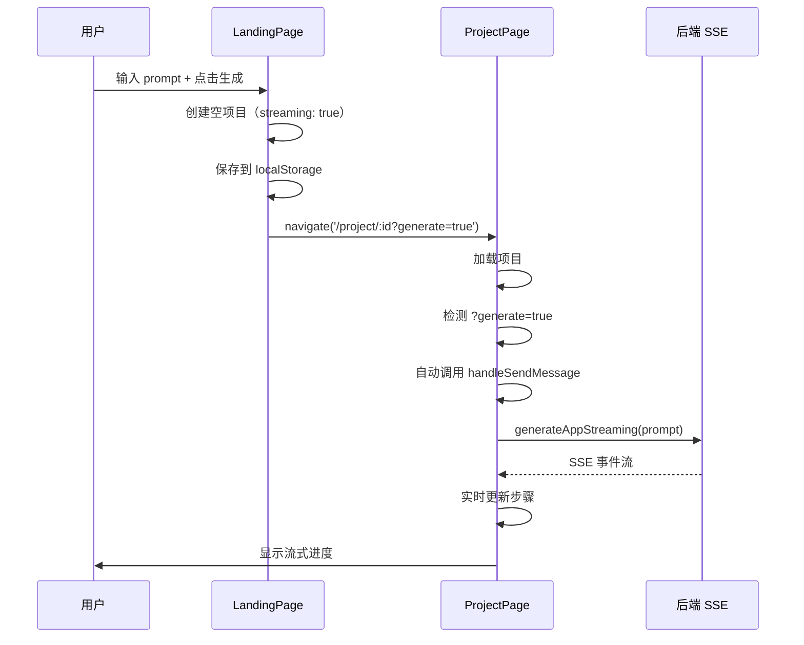

# 流式生成功能修复说明

## 问题原因

首页 `LandingPage.jsx` 还在使用旧的非流式 API `generateApp()`，导致看不到流式生成效果。

## 已修复内容

### 1. 修改 LandingPage.jsx ✅

**修改内容**:
- 导入流式 API `generateAppStreaming`
- 修改 `handleGenerate` 函数逻辑：
  - 创建初始项目（包含流式消息结构）
  - 立即跳转到项目页
  - 通过 URL 参数 `?generate=true` 触发自动生成

### 2. 修改 ProjectPage.jsx ✅

**修改内容**:
- 添加 `useSearchParams` hook
- 添加 `autoGenerateTriggered` ref（防止重复触发）
- 新增 useEffect 监听 URL 参数：
  - 检测 `?generate=true` 参数
  - 自动调用 `handleSendMessage` 开始流式生成
  - 避免重复生成（检查是否已有文件）

## 工作流程



## 测试步骤

### 1. 重新加载前端

如果前端正在运行，刷新浏览器页面（Ctrl+R 或 Cmd+R）

### 2. 测试流式生成

1. 访问首页 http://localhost:5173
2. 输入：`创建一个计数器应用，有增加和减少按钮`
3. 点击"开始创建"按钮
4. 应该立即跳转到项目页
5. 在左侧对话框中看到流式进度：

```
[用户消息]
创建一个计数器应用，有增加和减少按钮

[AI 消息 - 流式更新]
⟳ 正在分析需求...
✓ 使用模板: react-ts-shadcn
⟳ 正在生成代码...
✓ 已生成 package.json
✓ 已生成 src/pages/Index.tsx
✓ 已生成 src/App.tsx
✓ 代码生成完成 (19 个文件)

⟳ 正在启动容器...
✓ 挂载文件系统完成
⟳ 安装依赖中... (5-10秒)
⏱ 启动开发服务器 (等待)
```

### 3. 验证要点

- [x] 页面立即跳转到项目页（不等待生成完成）
- [x] 对话框中显示流式进度
- [x] 使用 lucide-react 图标（Loader2、CheckCircle2、Clock）
- [x] 步骤按顺序更新
- [x] 颜色正确（绿色=完成，主题色=进行中，灰色=等待）
- [x] 环境准备步骤也显示
- [x] 最终预览正确显示应用

## 后端日志验证

打开后端终端，应该看到：

```
POST /generate-stream  ← 注意：是 generate-stream，不是 generate
```

如果看到 `POST /generate`（非流式），说明前端还在使用旧 API。

## 调试

### 如果看不到流式效果：

1. **检查浏览器控制台**
   ```javascript
   // 查看是否有错误
   console.log(错误信息)
   ```

2. **检查 Network 面板**
   - 筛选 `generate-stream`
   - 应该看到 `Content-Type: text/event-stream`
   - Response 显示 SSE 数据流

3. **检查 URL**
   - 跳转后的 URL 应该是：`/project/1234567890?generate=true`
   - 如果缺少 `?generate=true`，说明 LandingPage 修改没生效

4. **检查后端**
   ```bash
   # 后端应该显示
   📝 收到生成请求: 创建一个计数器应用...
   ```

### 如果还是不行：

1. **硬刷新浏览器**
   - Chrome/Edge: Ctrl+Shift+R (Windows) 或 Cmd+Shift+R (Mac)
   - Firefox: Ctrl+F5 或 Cmd+Shift+R

2. **清除缓存**
   ```bash
   # 停止前端服务器
   # 删除 node_modules/.vite 缓存
   rm -rf node_modules/.vite
   # 重新启动
   npm run dev
   ```

3. **检查代码是否正确保存**
   ```bash
   # 查看修改后的文件
   cat client/src/pages/LandingPage.jsx | grep "generateAppStreaming"
   cat client/src/pages/ProjectPage.jsx | grep "useSearchParams"
   ```

## 预期结果

### 首页操作：
1. 输入 prompt
2. 点击"开始创建"
3. **立即**跳转到项目页（不等待）
4. URL 变为：`/project/1234567890?generate=true`

### 项目页：
1. 自动开始流式生成
2. 对话框显示实时进度
3. 每个步骤实时更新
4. 最终显示完整应用

## 文件修改清单

- ✅ `client/src/pages/LandingPage.jsx`
  - 导入 `generateAppStreaming`
  - 修改 `handleGenerate` 函数

- ✅ `client/src/pages/ProjectPage.jsx`
  - 添加 `useSearchParams`
  - 添加自动生成 useEffect

## 相关文档

- `QUICKSTART_STREAMING.md` - 快速启动指南
- `STREAMING_TEST.md` - 详细测试指南
- `STREAMING_IMPLEMENTATION_SUMMARY.md` - 实施总结

---

修复时间：2025-12-16  
状态：✅ 已修复  
测试：待验证

